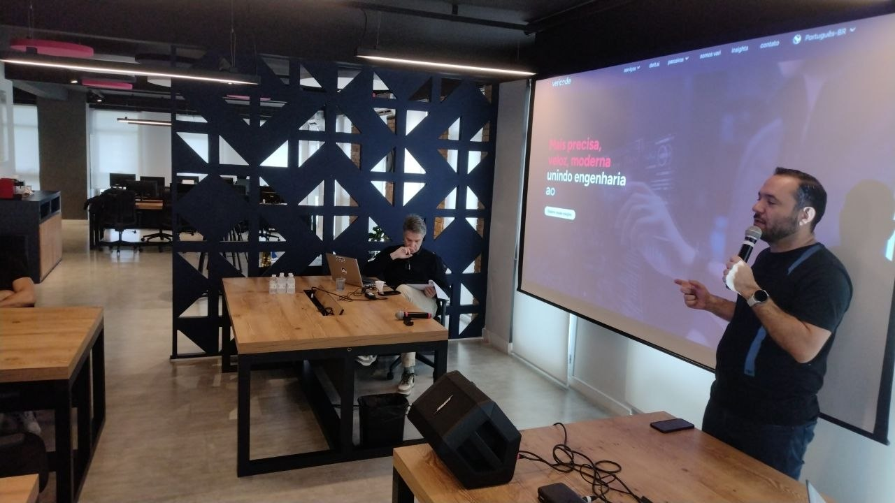
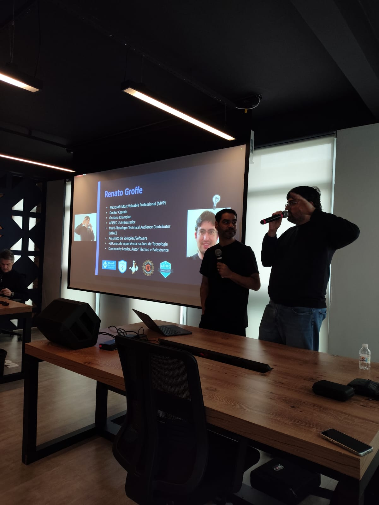
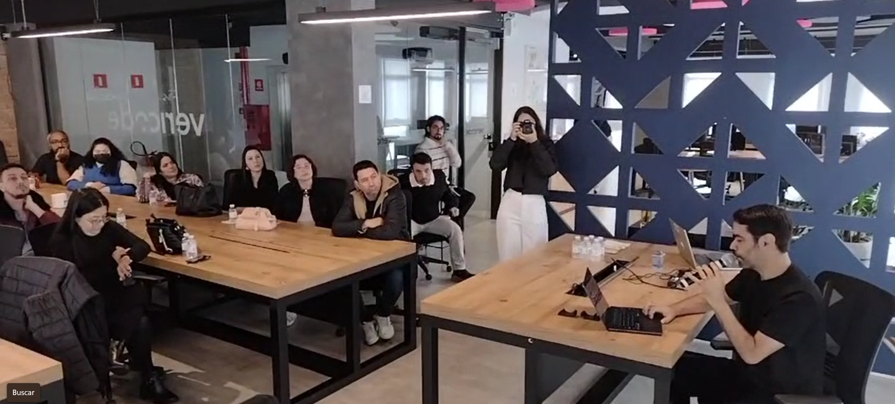
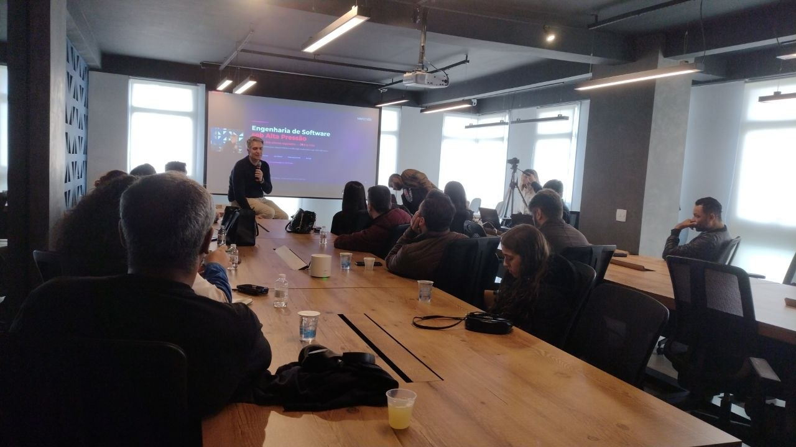
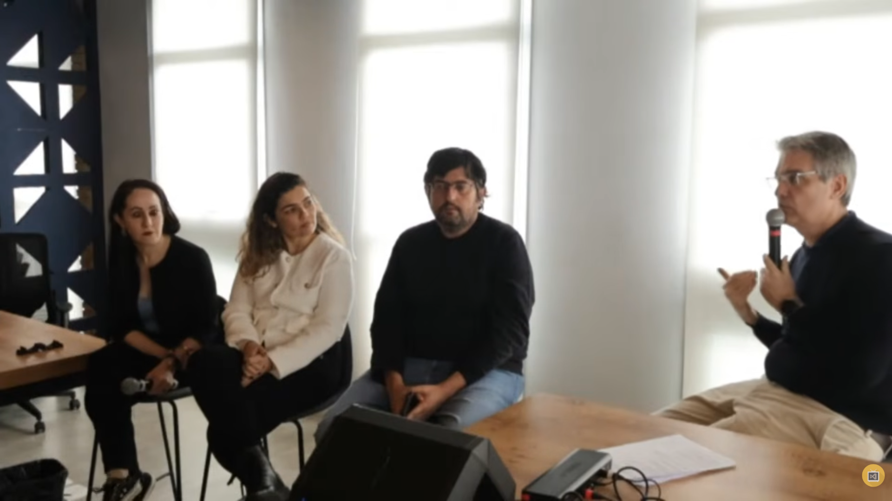
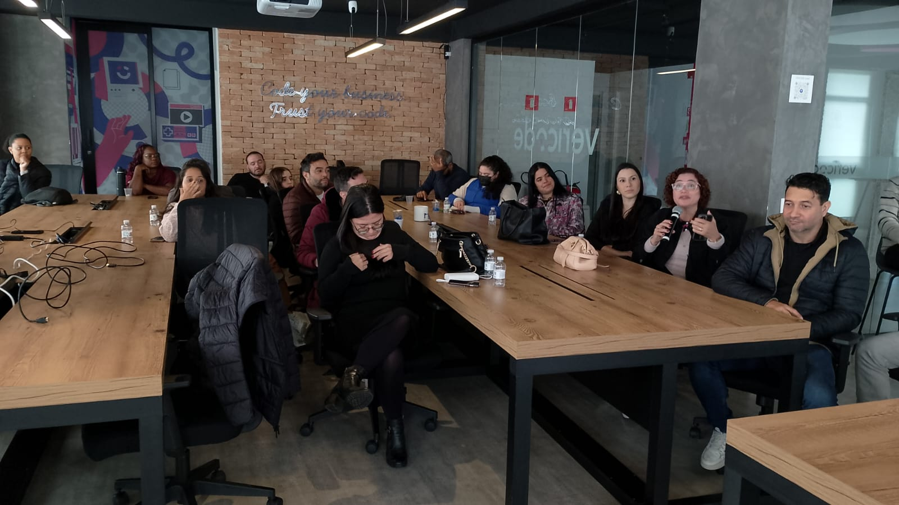
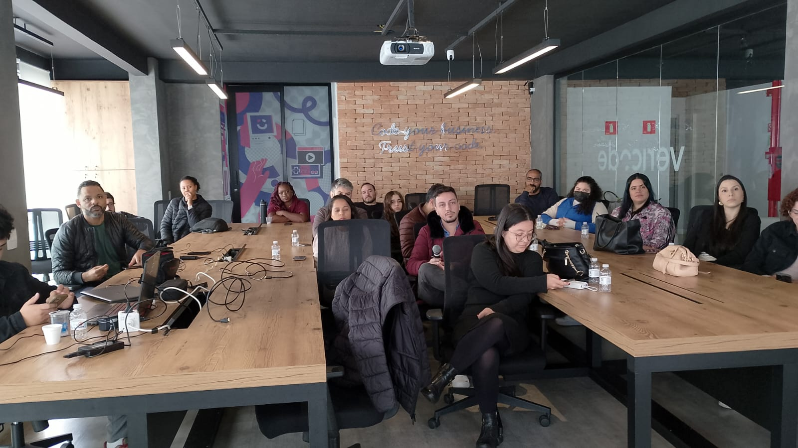
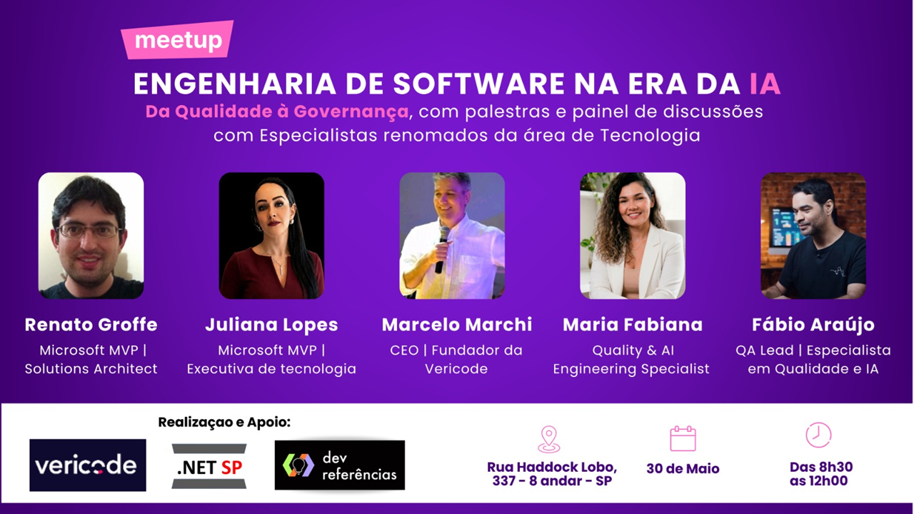

# engenharia-de-software-na-era-da-ia_2026-05
Fotos e informações gerais sobre o evento "Engenharia de Software na Era da IA", realizado na cidade de São Paulo-SP.

Data: **30/05/2026 (sábado)**

Organizadores:
- **Renato Groffe (Microsoft MVP, Docker Captain, Grafana Champion, APIsec U Ambassador, MTAC)**
- **Fábio Araújo (QA Lead, Dev Referências)**
- **Daniela Pacheco (Vericode)**
- **Maria Fabiana (Vericode)**

Número de participantes: **35 pessoas**

Um vídeo com a gravação das apresentações está disponível no **YouTube**: **https://www.youtube.com/watch?v=YotQYkVlDc0**

---

Apresentações/talks que aconteceram durante o evento:

_# MCP + IA + Performance com k6 + Observabilidade_

Palestrantes: **Fábio Araújo (Dev Referências), Renato Groffe (Microsoft MVP, Docker Captain, Grafana Champion, APIsec U Ambassador MTAC)**

Tecnologias e tópicos abordados: **Grafana k6, MCP, Visual Studio Code, GitHub Copilot, Observabilidade, Inteligência Artificial, LLMs, MCP, DevOps, Azure Container Apps, OpenTelemetry, Application Insights, Azure Monitor, Docker, ASP.NET Core, .NET, Docker, Containers...**

_# Desafios do mercado regulado na era da IA_

Palestrante: **Marcelo Marchi (CEO e Fundador da Vericode)**

Tecnologias e tópicos abordados: **Inteligência Artificial, LLMs, MCP, GitHub Copilot, Claude, Desenvolvimento de Software, Desenvolvimento Web, Qualidade de Software...**

_# Painel: Governança suportada por IA_

Participantes:
- **Maria Fabiana (Vericode)**
- **Marcelo Marchi (CEO e Fundador da Vericode)**
- **Juliana Lopes (Microsoft MVP)**
- **Renato Groffe (Microsoft MVP, Docker Captain, Grafana Champion, APIsec U Ambassador MTAC)**

Tecnologias e tópicos abordados: **Inteligência Artificial, LLMs, MCP, GitHub Copilot, Claude, Desenvolvimento de Software, Desenvolvimento Web, Qualidade de Software, Segurança, OWASP Top 10 LLM, OWASP Top 10 MCP, Cybersegurança...**

---

Acesse este [**link**](/img/) para visualizar todas as fotos das apresentações.

Este evento foi uma parceria entre as comunidades [**Dev Referências**](https://www.devreferencias.com.br/), [**.NET SP**](https://www.meetup.com/dotnet-Sao-Paulo/) e a [**Vericode**](https://vericode.com.br/pt).

Formulário utilizado para inscrições: [**Sympla**](https://www.sympla.com.br/evento/engenharia-de-software-na-era-da-ia---gratuito-e-presencial---sao-paulo-sp/3423798)

Local: **Rua Haddock Lobo, 337 - 8o andar - Cerqueira César - CEP: 01414-001 - São Paulo/SP**

---

